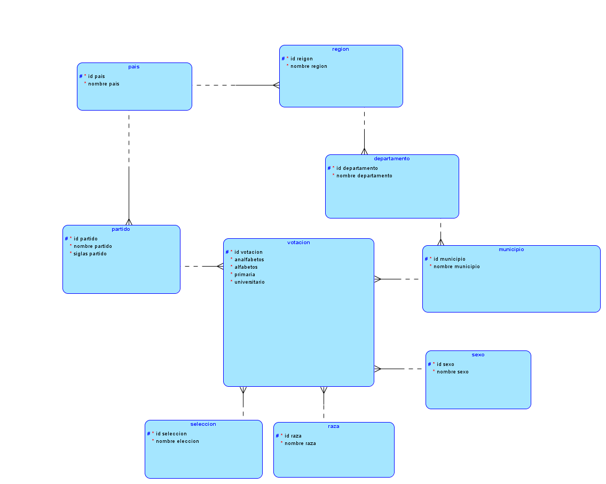
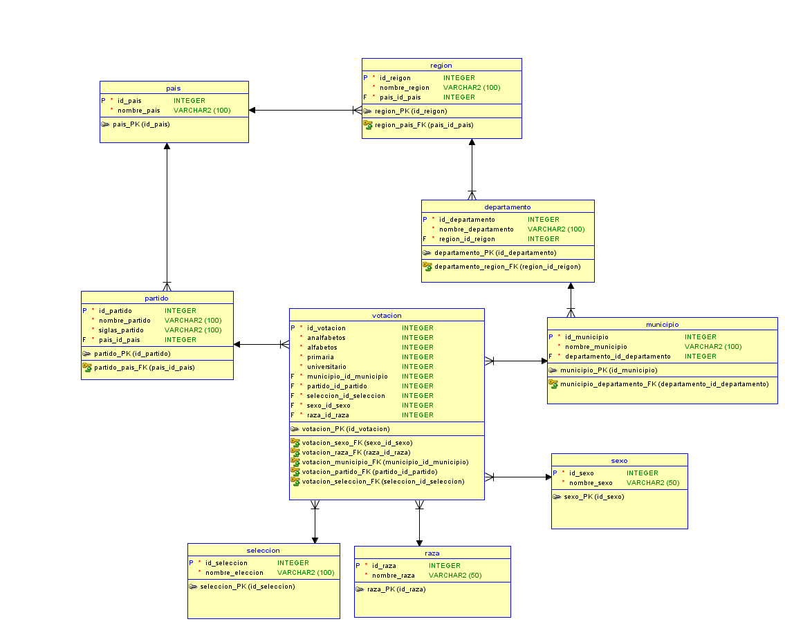

# DOCUMENTACION 

## Universidad de San Carlos de Guatemala 
## Sistema de Base de datos 1
## Segundo Semestre del 2021
## Proyecto 2

# Reglas de Normalizacion 

Reglas de Normalizacion aplicadas para la construccion de la base de datos. 

## 1FN 

Aplicando la primera regla de normalizacion en la base de datos de la cual nos ayuda con los datos repetidos los cuales nos generan la creacion de redundacia en la cual nos permite la eliminacion de las columnas con datos repetidos como sexo y raza en el archivo de entrada y poder tratar la informacion entrante en con su primera forma normalizada.

## 2FN 

Segundo forma normal ayuda a ordenar las tablas (Pais, Region, Departamento, Municipio, Partido y votacion) en conjuntos separados y tenerlas para registros multiples en la base de datos y poder tener las tablas relacionadas con llaves foreaneas.

## 3FN

La segundo regla de normalizacion la cual ayudo a localizar las dependencias formales, transitivas y que no se saben que no dependa de la clave primaria y poderlas separar de la tabla y asi evitar la repeticion de datos en el cual de la tabla votacion se separo surgiendo las tablas (sexo, raza y el tipo de elccion que se llevo a cabo).

# Modelos 

## Modelo Logico 
 

## Modelo Fisico
 

---
# Listado de Entidades

| Entidad       | Descripcion |
|---------      |-------------| 
| Pais          | Almacena un listado de distintos paises |
| Region        | Guarda las regiones que posee cada pais |
| Departamento  | Almacena diferentes departamentos de cada pais con su region |
| Municipio     | Alamacena cada municipo de cada Departamento |
| Partido       | Guarada cada partido participante de cada pais |
| Sexo          | Almacena los sexos distingibles para cada votatante |
| Raza          | Alamacena todas las razas que tiene participacion en la votacion |
| Seleccion     | Almacena los tipo de elecciones que se efectuaron |
| Votacion      | Guarda todas la votaciones exitentes a nivel de municipo |

# Listado de Atributos

## Pais
| Nombre    | Tipo      | Primary   | Forean    | Unique    | Not Null  |
| ------    | ------    | ------    | ------    | ------    | --------  |
|id_pais    | Integer   |    X      |           |           |  X        |
|nombre_pais|Varchar(100)|          |           |           |  X        |

## Region
| Nombre    | Tipo      | Primary   | Forean    | Unique    | Not Null  |
| ------    | ------    | ------    | ------    | ------    | --------  |
|id_region  | Integer   |    X      |           |           |  X        |
|nombre_region|Varchar(100)|        |           |           |  X        |
|id_pais    | Integer   |           |    X      |           |  X        |

## Departamento
| Nombre    | Tipo      | Primary   | Forean    | Unique    | Not Null  |
| ------    | ------    | ------    | ------    | ------    | --------  |
|id_departamento| Integer   |    X      |       |           |  X        |
|nombre_departamento|Varchar(100)|      |       |           |  X        |
|id_region  | Integer   |           |    X      |           |  X        |

## Municipio
| Nombre    | Tipo      | Primary   | Forean    | Unique    | Not Null  |
| ------    | ------    | ------    | ------    | ------    | --------  |
|id_departamento| Integer   |    X      |       |           |  X        |
|nombre_departamento|Varchar(100)|      |       |           |  X        |
|id_region  | Integer   |           |    X      |           |  X        |

## Partido
| Nombre    | Tipo      | Primary   | Forean    | Unique    | Not Null  |
| ------    | ------    | ------    | ------    | ------    | --------  |
|id_partido | Integer   |    X      |           |           |  X        |
|nombre_partido|Varchar(100)|       |           |           |  X        |
|siglas_partido|Varchar(100)|       |           |           |  X        |
|id_region  | Integer   |           |    X      |           |  X        |

## Sexo
| Nombre    | Tipo      | Primary   | Forean    | Unique    | Not Null  |
| ------    | ------    | ------    | ------    | ------    | --------  |
|id_sexo    | Integer   |    X      |           |           |  X        |
|nombre_sexo|Varchar(50)|           |           |           |  X        |

## Raza
| Nombre    | Tipo      | Primary   | Forean    | Unique    | Not Null  |
| ------    | ------    | ------    | ------    | ------    | --------  |
|id_raza    | Integer   |    X      |           |           |  X        |
|nombre_raza|Varchar(50)|           |           |           |  X        |

## Seleccion
| Nombre    | Tipo      | Primary   | Forean    | Unique    | Not Null  |
| ------    | ------    | ------    | ------    | ------    | --------  |
|id_seleccion| Integer  |    X      |           |           |  X        |
|nombre_seleccion|Varchar(100)|     |           |           |  X        |

## Votacion
| Nombre    | Tipo      | Primary   | Forean    | Unique    | Not Null  |
| ------    | ------    | ------    | ------    | ------    | --------  |
|id_votacion| Integer   |    X      |           |           |  X        |
|analfabeto |Integer    |           |           |           |  X        |
|alfabeto   |Integer    |           |           |           |  X        |
|primaria   |Integer    |           |           |           |  X        |
|nivel_meido|Integer    |           |           |           |  X        |
|universitario|Integer  |           |           |           |  X        |
|id_sexo    | Integer   |           |    X      |           |  X        |
|id_raza    | Integer   |           |    X      |           |  X        |
|id_seleccion| Integer  |           |    X      |           |  X        |
|id_partido | Integer   |           |    X      |           |  X        |
|id_municipio| Integer  |           |    X      |           |  X        |

# Relacion entre Entidades

| Tabla         | Tabla         | Relacion   |
| ------        | ------        | ------     |
| pais          | region        |Un pais puede tener varias regiones y una region pertenece a un pais|
| region        | departamento  |Una region puede tener uno o mas departamentos y un departamento pertenece una reigon            |
| depatamento   | municipio     |Un departamento tiene uno o mas municipios y un municipo pertenece a un departament     |
| pais          | partido       |Un pais puede tener uno o mas partidos politicos y un partido politico pertence y participa en un pais     |
| sexo          | votacion      | Un votacion esta distingidad por un tipo de sexo y un tipo de sexo puede estar en mas de una votacion     |
| raza          | votacion      |Una votaccion esta distingidad por un tipo de raza y un tipo de raza puede estar en mas de una votacion     |
| seleccion     | votacion      |Una votacione tiene un tipo de seleccion y una seleccion de votacion puede tener mas de una votacion      |
| partido       | votacion      |Un partido puede tener mas de una votacion y una votacion pertence a un partido |
| municipio     | votacion      |Un municipio puede tener mas de una votacion y una votacion pertenece o fuer realizada en un municipio     |

# Restriccione para Utilizar 

* Los Votantes solo pueden estar distinguidas como hombre y mujer
* Los Votantes puede pertenecer a una sola raza
* Las Votaciones solo estan distinguidas por elecciones a nivel Municipal

